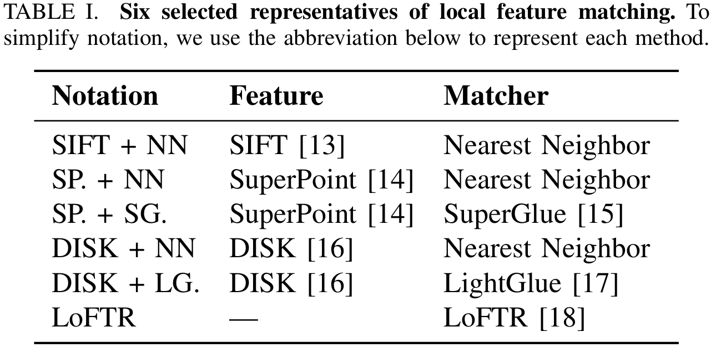

# hloc - the hierarchical localization toolbox

This is `hloc`, a modular toolbox for state-of-the-art 6-DoF visual localization. It implements [Hierarchical Localization](https://arxiv.org/abs/1812.03506), leveraging image retrieval and feature matching, and is fast, accurate, and scalable. This codebase combines and makes easily accessible years of research on image matching and Structure-from-Motion. Refer to the original [README](README_old.md) for basic installation. 


## Customized Pipeline for feature extraction and matching
This mainly serves for the easy usage of [GV-Bench](https://github.com/jarvisyjw/GV-Bench). The customized pipeline includes 6 keypoints detection and matching used in GV-Bench:

<p align="center">
   <a href="https://arxiv.org/abs/2407.11736"></a>
  <br /><em>Matching Methods Evaluated in GV-Bench</em>
</p>

### Usage
```bash
cd Hierarchical-Localization
conda activate env # activate your env
python gvbench.py config/yourconf.yaml --extraction
python gvbench.py config/yourconf.yaml --matching 
python gvbench.py config/yourconf.yaml --matching_loftr
```

## BibTex Citation

If use any of the tools provided here, please consider citing both [Hierarchical Localization](https://arxiv.org/abs/1812.03506) and [SuperGlue](https://arxiv.org/abs/1911.11763), and perhaps [GV-Bench](https://arxiv.org/abs/2407.11736).

```
@inproceedings{sarlin2019coarse,
  title     = {From Coarse to Fine: Robust Hierarchical Localization at Large Scale},
  author    = {Paul-Edouard Sarlin and
               Cesar Cadena and
               Roland Siegwart and
               Marcin Dymczyk},
  booktitle = {CVPR},
  year      = {2019}
}

@inproceedings{sarlin2020superglue,
  title     = {{SuperGlue}: Learning Feature Matching with Graph Neural Networks},
  author    = {Paul-Edouard Sarlin and
               Daniel DeTone and
               Tomasz Malisiewicz and
               Andrew Rabinovich},
  booktitle = {CVPR},
  year      = {2020},
}

@article{yu2024gv,
  title={GV-Bench: Benchmarking Local Feature Matching for Geometric Verification of Long-term Loop Closure Detection},
  author={Yu, Jingwen and Ye, Hanjing and Jiao, Jianhao and Tan, Ping and Zhang, Hong},
  journal={arXiv preprint arXiv:2407.11736},
  year={2024}
}
```

## Acknowledgement
Thanks for the original [[HLoc]](./README_old.md).
